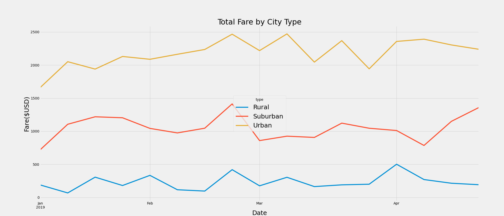

# Pyber_Analysis

## Overview of the analysis

This analysis was made in order to see the total amount of fares generated in USD per week for the months of January to April 2019 by PyBer for each type of city.

## Results

Here are the results of the analysis:

As observed, urban cities generate the most weekly fares, followed by suburban cities then rural cities in last place. 
These fares are fairly consistent from week to week, but all three types of cities have seen an increase in fares for the third week of February. 

## Summary

Here are three of my business recommendations following the analysis:

1. PyBer should expand into more urban cities as they generate the most fares
2. PyBer should not waste too much ressources and monies to expand to rural cities as they generate very little fares
3. PyBer should look to increase drivers during periods where there might be more ride demand such as holidays
